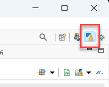
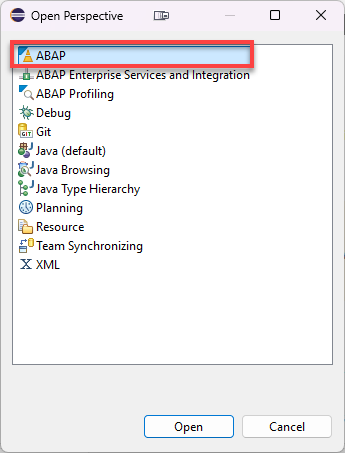
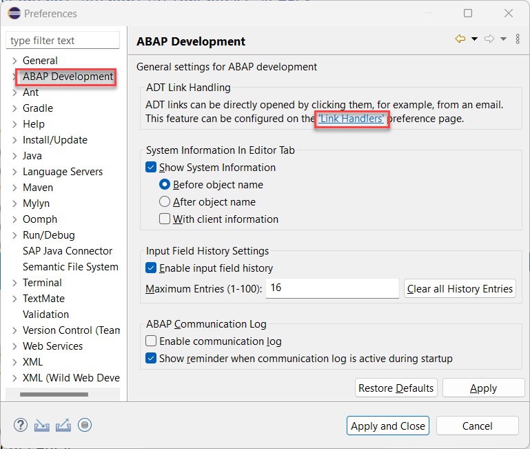
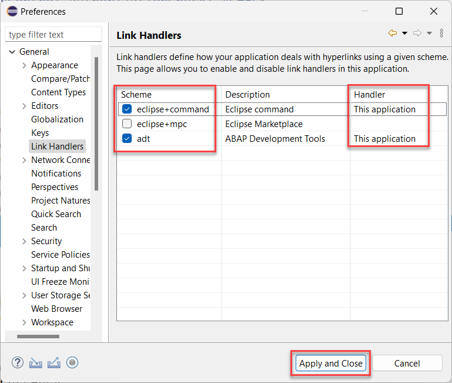

[Home - AD163](/README.md#exercises)

## Select the ABAP Perspective

Make sure that you are using the ABAP Perspective in your Eclipse (ADT) window. 

If it is active, you will see the ABAP icon in the upper right corner of your Eclipse.  

  

If it is not active, from the menu choose **Window** > **Perspective** > **Open Perspective** > **Other** and then **ABAP** from the **Open Perspective** dialogue.

## Configure ADT for the use with SAP Build

ADT is started from within SAP Build Code using a so called shortcuts `eclipse+command` or `ADT` depending on the type of integration.  
As this functionality is a build-in feature of Eclipse, it needs to be configured there.
In Eclipse this technique is called **link handler**.

The **link handler** is part of the Eclipse installation environment on your computer and enables external tools (i.e. SAP Build) to start the correct Eclipse with ADT installed.

### Configuration steps on Windows

If you are using a Windows computer you have to check the link handler settings that are used to start ADT as follows:

Click to expand the detailed description

1. Start your Eclipse with ADT installed (from the last step)

2. From the menu choose `Window` --> `Preferences`  

3. Choose **ABAP Development** from the menu on the left hand side.

4. Click on **Link Handlers**

   

5. Make sure that both entries `adt` and `eclipse+command` are being checked 
   and marked **`This application`**.
   This is especially important if your have installed more than one Eclipse instance on your computer.

   

### Configuration on Mac

If you are using a Mac you have to check the link handler settings that are used to start ADT as follows:

Click to expand the detailed description

1. Start your Eclipse with ADT installed (from the last step)

2. From the menu choose `Eclipse` --> `Settings...`  

3. Choose **ABAP Development** from the menu on the left hand side.

4. Click on **Link Handlers**

   

5. Make sure that both entries `adt` and `eclipse+command` are being checked 
   and marked **`This application`**.
   This is especially important if your have installed more than one Eclipse instance on your computer.

   

**Great!**

Now you enabled the ADT inside Eclipse to be started from SAP Build Code.

This will be used within the following exercises, when SAP Build provides links of generated object to open the same automatically using Eclipse/ADT.  

You can continue with the first exercise in the Business Application Studio - **[ Start your development by creating an ABAP project in the SAP Business Application Studio](../ex1/README.md)**.