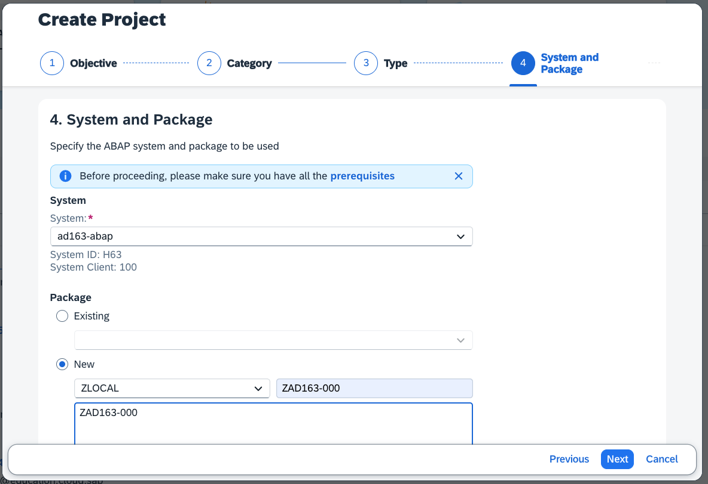
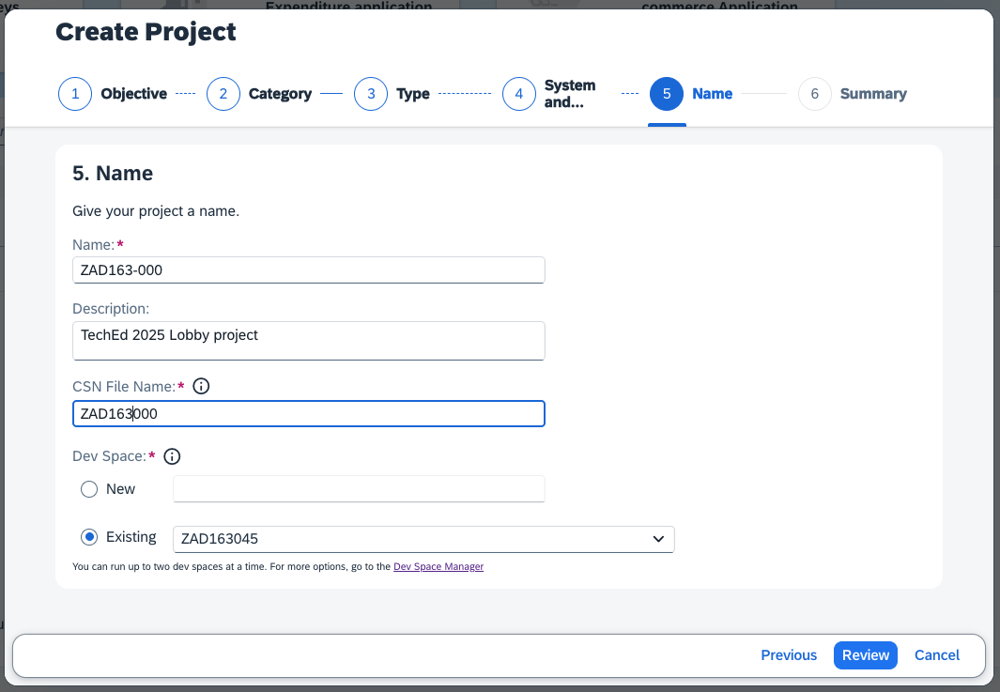
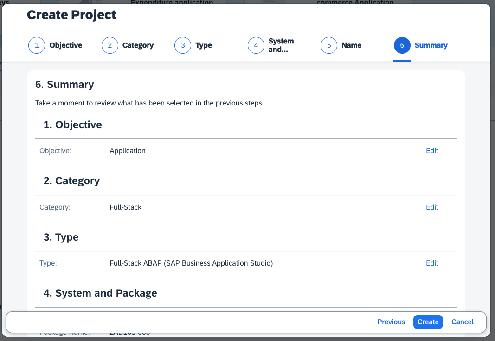

[Home - AD163](/README.md#exercises)

# Exercise 1: Start your development by creating an ABAP project in the SAP Build Lobby

## Introduction

In this exercise, you will setup your ABAP development project in the SAP Build Lobby linking your ABAP development package, the modeling file and the Business Application Studio dev space. From the Build Lobby you will be able to manage your different Build project types, from ABAP to CAP.

> **Reminder:**   
> Don't forget to replace all occurences of the placeholder **`###`** with your suffix or Group ID in the exercise steps below.
> ***

 The suffix which is based on your Group ID has different values depending on the event you are participating:   

 | **Event name**                          | **Artifact Prefix**                   |  
 |----------------------------------------|---------------------------------|       
 | **ASUG TechConnect in Louisville**       | **A##**                                |     
| **SAP TechEd Berlin**                    | **B##**                                | 

## Exercise: Create an ABAP Project

[^Top of page](#)

1. In your browser, sign in to the Build lobby at https://ad163-wobbi9xc.eu10.build.cloud.sap/lobby with the credentials of your exercise group.
2. In the Build Lobby, click on **Create** right above the empty project list. Select **Create** from the button drop-down. This opens the Create Project dialog.
   

3. In the **Create Project** dialog, select **Application**, click **Next**, as category select **Full-Stack**, advance with **Next** and finally select **Full-Stack ABAP (SAP Business Application Studio)**, and advance with **Next**.

   

4. In the **System and Package** dialog, maintain the required information as follows:
   > ℹ️ ** Replace **`###`** with your suffix or the Group ID of your exercise group.  
   > For the screenshots in this exercise we used the suffix **`000`**. Please do not use **`000`**.  
   
   - System: **ad163-abap**
   - Package: **New >**
   - Super Package: **ZLOCAL**
   - New package: **ZAD163_###**
   - Description: **ZAD163_###**

   Advance with **Next**.
   
   

> Backup: If creating a new package does not work, we created a package for your exercises with your Group ID. In that case select **Existing >** and enter **zad163-###-bck**.

5. In the **Name** dialog, maintain the following values:
   - Name: **ZAD163_###**
   - Description: **TechEd 2025 Lobby project**
   - CSN File Name: **ZAD163_###**
   - Dev Space: **Existing >** **ZAD163###**

   

   Advance to reviewing your information with **Review**.

6. Review your selections and inputs. Make sure you replaced **###** with your exercise Group ID. Finish the project setup with **Create**.

   

7. In the project list you can now see the newly created project **ZAD163_###**. Be patient in case it shows in the **Versions** column **Pending Creation**. The project is being created and the SAP Build Code Dev Space might be being started.
Once the **Versions** column is empty, click on the project name to open SAP Build.

## Summary & Next Exercise
[^Top of page](#)

Now that you've... 
- created an ABAP project in the lobby,
- created a new development package on the AD163 system,
- and created a new CSN file that will contain the data created by the CDS modeler

you can continue with the next exercise in the Business Application Studio - **[Exercise 2: Create a Shopping Cart business object, projection and service with the graphical modeler in SAP Build Code](../ex2/README.md)**.

## License

Copyright (c) 2024 SAP SE or an SAP affiliate company. All rights reserved. This project is licensed under the Apache Software License, version 2.0 except as noted otherwise in the [LICENSE](LICENSES/Apache-2.0.txt) file.
