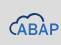
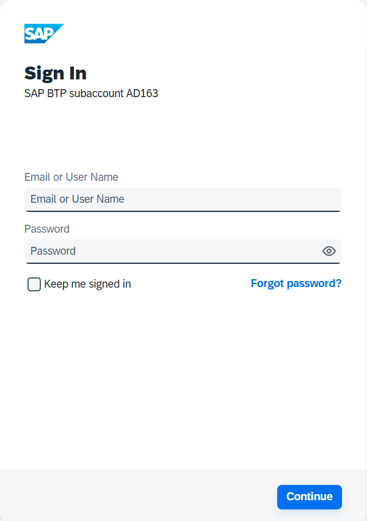
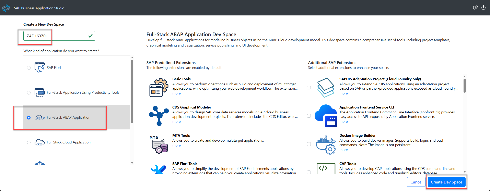
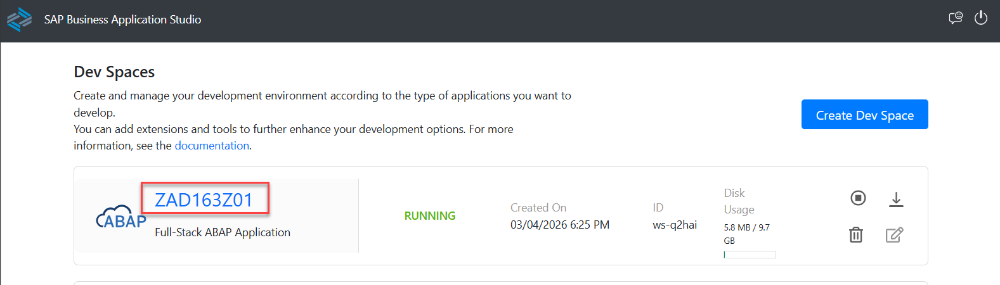
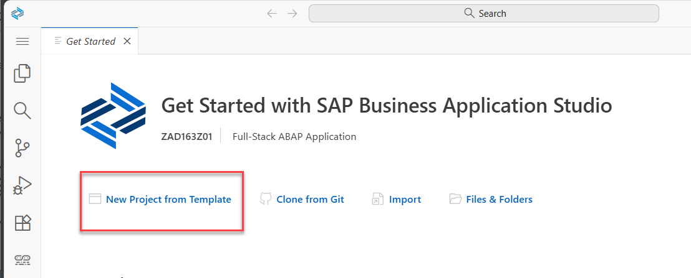
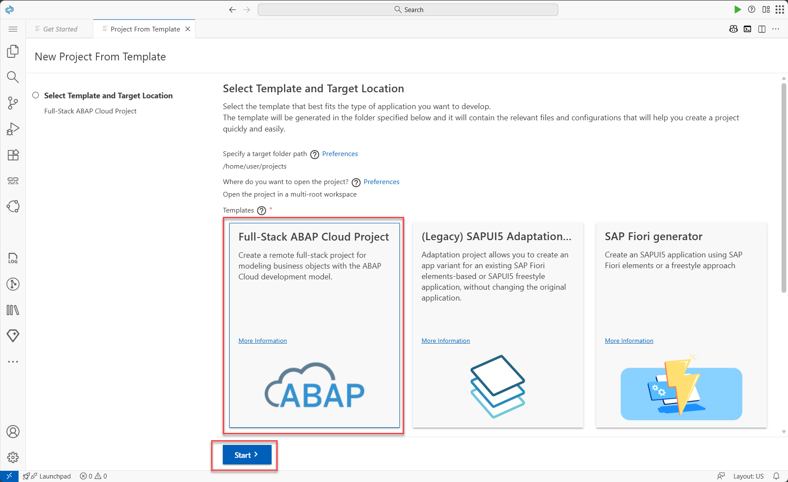
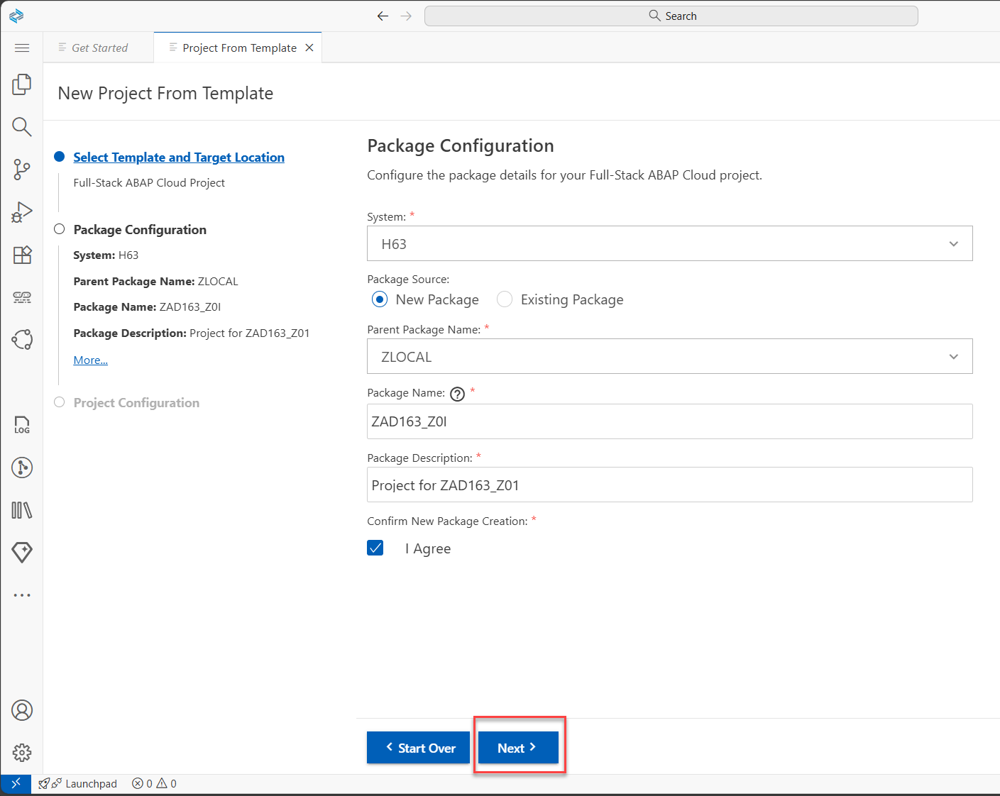
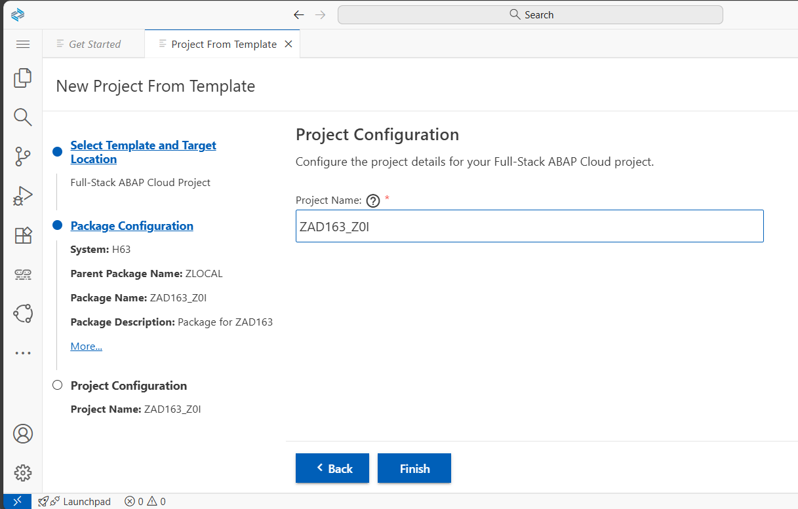

[Home - AD163](/README.md#exercises)

# Exercise 1: Start your development by creating an ABAP project in the SAP Business Application Studio

## Introduction

In this exercise, you will setup your _ABAP development project_ in _SAP Business Application Studio_. The _ABAP development project_ links your ABAP development package and the modelling file - that both reside in the ABAP stack - with SAP Business Application Studio. Inside SAP Business Business Application Studio all development artefacts are stored inside a so called  Dev Space.  
For ABAP projects there is a special Dev Space type  **Full-Stack ABAP Application**

> **Reminder:**   
> Don't forget to replace all occurences of the placeholder **`###`** with your Group ID in the exercise steps below.   
> The password will be provided by the course instructors. 

 Your Group ID starts with a location specific character **A** for ASUG, **B** for TechEd Berln, ...
 
 In addition you have to add the last two digits of the number at your desk **##**.
 
 So depending on the event you are participating your Group ID will look like follows:   

 | **Event name**                          | **Group ID** (location specific)                  |  System |
 |----------------------------------------|---------------------------------|---------------------------------            
| **ASUG TechConnect in Louisville**       | **A##**                                |    |
| **SAP TechEd Berlin**                    | **B##**                                |    |
| **TechEd On Tour - Bangalore 2025**      | **C##**                                |    |
| **TechEd On Tour - Sydney 2025**         | **D##**                                |    |
| **TechEd On Tour - TechXChange 2026**    | **G##**                                |    |

## Exercise: Create an ABAP Project

[^Top of page](#)

1. In your browser, sign in to SAP Business Application Studio with the credentials of your exercise group.

> The URL and the username and the password will be provided to you by the course instructors.
> The URL to the SAP Build Lobby is provided as a shortened URL in a format such as https://url.sap/abc123.

2. Add the shortened URL for the DevSpace Manager of SAP Business Application Studio into your browser.

3. When being prompted enter the credentials:

   - email: `AD163-###@....`
   - password: `xxxx`

   ⚠️⚠️⚠️ Be sure to replace the placeholder `###` with the correct group id. (`A##` for ASUG, `B##` for SAP Teched, ...) 

   

4. Click on **Create Dev Space** to create a new dev space of type **Full-Stack ABAP Application**. 

5. Enter a name for the dev space `ZAD163###` and choose **Full-Stack ABAP Application** and then press **Create Dev Space** 

    

   This dev space includes essential extensions such as the CDS Graphical Modeler, SAP Fiori Tools, and Full-Stack ABAP tools.

6. Wait until the status of the DevSpace switches from **Starting** to **Running**

7. Click on the DevSpace `ZAD163###` 

    
   
8. Click on **New Project from Template**
 
   

9. Select **Full Stack ABAP Cloud Project** and then press **Start**

   
   
10. In following screen follow the wizard and enter the following data and press **Next** 
    - As **System** select **H63** from the drop down box.   
    - For **Package Source** select **New**.
    - For **Parent Package Name** enter **`ZLOCAL`**
    - For **Package Name** enter **`ZAD163_###`**.
    - For **Package Description** enter **`Package for ZAD163_###`**.
    - Confirm New Package Creation by ticking the check box   
  
    

11. Select  **`ZAD163_###`** as the project name of your Full Stack ABAP Cloud Project in SAP Business Application Studio and press **Finish**

    ⚠️ Please note that the project name will also be choosen as the repository object name of the CSN file in the SAP BTP ABAP Environment system. It has hence has either to start with `Z`.

    

   > The **CSN File** is a JSON file that is used by the graphical modeller (that we will use later to model our RAP business object).
   It is stored as a repository object of type **R3TR CSNM** in the ABAP stack and the name must therefore start with `Z` or with a customer or partner specific namespace `/<namespace>/`.  
   > In addition you have to select a name for a Dev Space that will be used by SAP Build Code. Since the Dev Space `ZAD163_###` does not exist yet, it will be created and started. The startup of the Dev Space will take some time as a new runtime environment will be instantiated in SAP Build.   
   > Please be aware that only up to two Dev Space may be active in parallel for each user and that only up to 10 Dev Spaces maybe created for each user.  

## Summary & Next Exercise
[^Top of page](#)

Now that you've... 
- created an ABAP project in the lobby of SAP Build,
- and created a new CSN file that will contain the data created by the graphical CDS modeler that will be used in the following exercise

you can continue with the next exercise in the Business Application Studio - **[Exercise 2: Create a Shopping Cart business object, projection and service with the graphical modeler in SAP Build Code](../ex2/README.md)**.

## License

Copyright (c) 2024 SAP SE or an SAP affiliate company. All rights reserved. This project is licensed under the Apache Software License, version 2.0 except as noted otherwise in the [LICENSE](LICENSES/Apache-2.0.txt) file.
