[Home - AD163](/README.md#exercises)

# Exercise 3: Implement transactional behavior in ADT, create validations and determinations

## Introduction

In this exercise, you will implement the transactional behavior to the RAP business object. The repository objects have been generated based on the CSN-model that has been created in SAP Business Application Studio using the graphical modeler.

For this we have to maintain the following objects:  
- Behavior Definition / Behavior Implementation Class
  - add a determination and a validation to the behavior definition  
  - implement the determination and the validation in the behavior implementation class
  - make some fields read-only since they will be determined by the above mentioned determinations

- Behavior Projection 
  - make some fields read-only on projection level 

> For a more complete implementation of your RAP BO you will need to implement several determinations and validations. However due to time-constraints we will only implement one determination and one validations to show the concept. 
> The implementation of additional ABAP business logic is described in the **optional Exercise 5**. **[Optional - Exercise 5: Complete the RAP implementation](../ex5/README.md)**.

### Exercise Steps

- [3.1 - Create an ABAP Cloud Project in ADT](#31---create-abap-cloud-project-in-adt)
- [3.2 - Test the generated rap business object](#32---test-the-generated-rap-business-object)  
- [3.3 - Define determinations](#33---define-determinations) 
- [3.4 - Implement the determinations using Joule](#34---implement-the-determination-using-joule-)
- [3.5 - Define validations](#35---define-validations)
- [3.6 - Implement the validations using Joule](#36---implement-the-validations-using-joule-)
- [3.7 - Preview and test the enhanced online shop app](#37---preview-and-test-the-enhanced-online-shop-app)
- [Summary](#summary)
- [Next exercise](#summary--next-exercise)
- [Summary & Next Exercise](#summary--next-exercise)  


> ℹ️**Reminder:**   
> Don't forget to replace all occurences of the placeholder **`###`** with your suffix or Group ID in the exercise steps below.   
> You can use the ADT function **Replace All** (**Ctrl+F**) for this purpose. 


## 3.1 - Create ABAP cloud project in ADT

You will now create an ABAP Cloud project in ADT in order to enhance the generated code and to implement some business logic.   

<!--You can do so directly from within Business Application Studio, or you can create the project manually from within ADT.


### 3.1.1 - Create an ABAP Cloud Project from within BAS

<details>
<summary>Click to expand</summary>

1. Open SAP Build Lobby.  
   
   > The URL and the username and the password will be provided to you by the course instructors.   
   > The URL to the SAP Build Lobby is provided as a shortened URL in a format such as `https://url.sap/abc123`. 

2. Add the shortened URL for the SAP Build Lobby into your browser.

3. Open your **Full Stack ABAP Application** project `ZAD163_###` that you have created in the previous exercise, so that your Full Stack ABAP Application Project is opened in Business Application Studio again.

4. Open the File Explorer  in Business Application Studio on the left hand side menu and select the entry for the Service Binding `Z###UI_CARTSERVICE_O4`.

   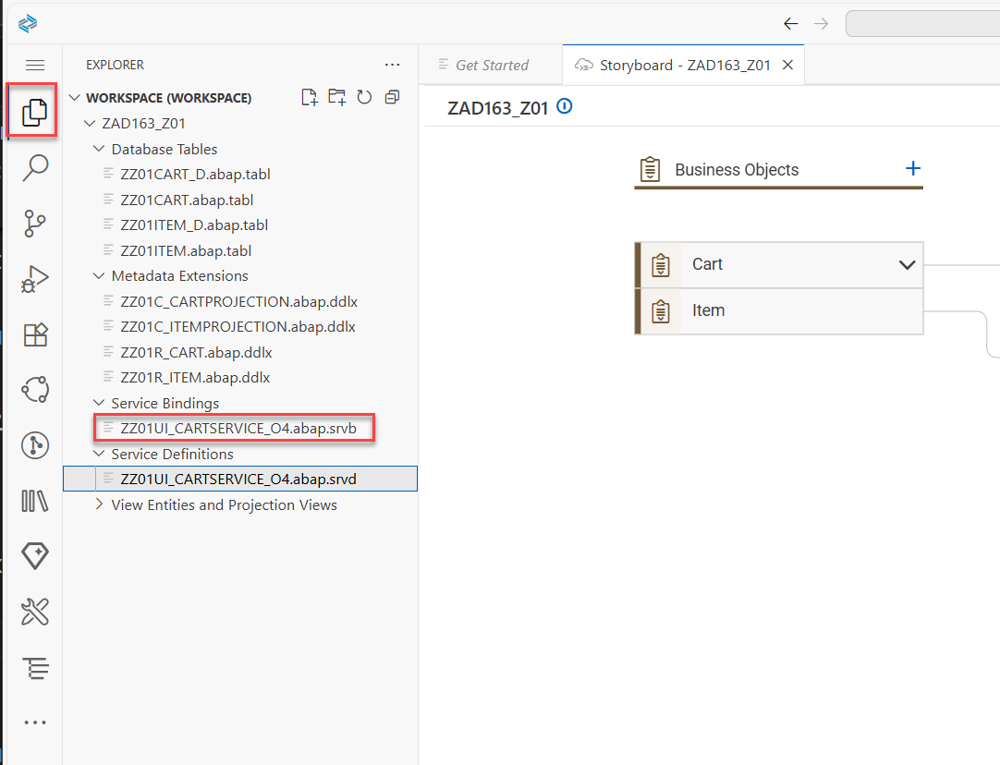   

5. Now click on the link called **Open this object in ADT** as shown in the following screen shot:
   
   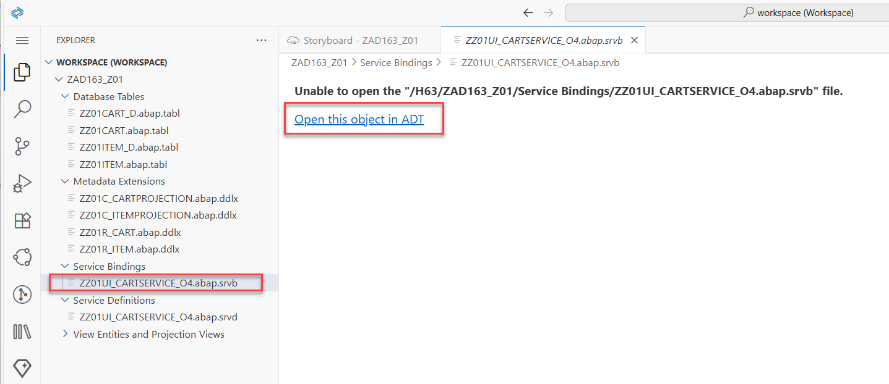   
   
6. ADT will be opened and since no ABAP Cloud project has been created yet for this system (this SID) you have to press the button **New** in order to start the creation of a new ABAP Cloud project in ADT.   

   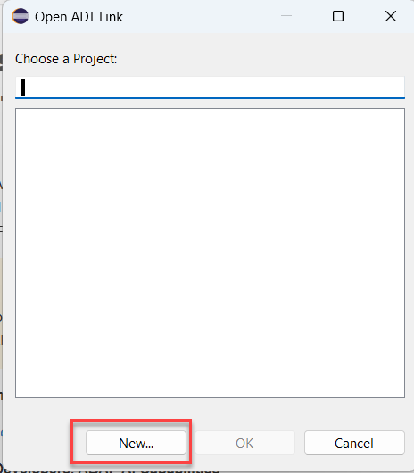 

7. Select **ABAP Cloud Project** as the project type.   

   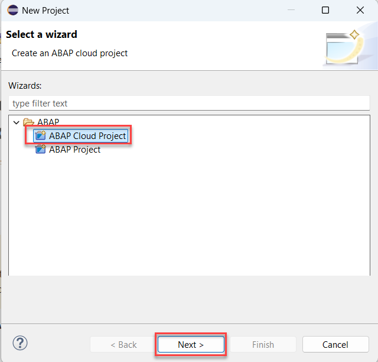 

8. Copy the URL of the SAP BTP ABAP Environment System into the field **ABAP Service Instance URL** and click **Next >**.

   > The URL of the SAP BTP ABAP Environment will be provided to you by the course instructors.
   > The URL is provided as a shortened URL in a format such as `https://url.sap/abc123`.   
   > Copy the expanded URL from the browser into the field **ABAP Service Instance URL**.   

   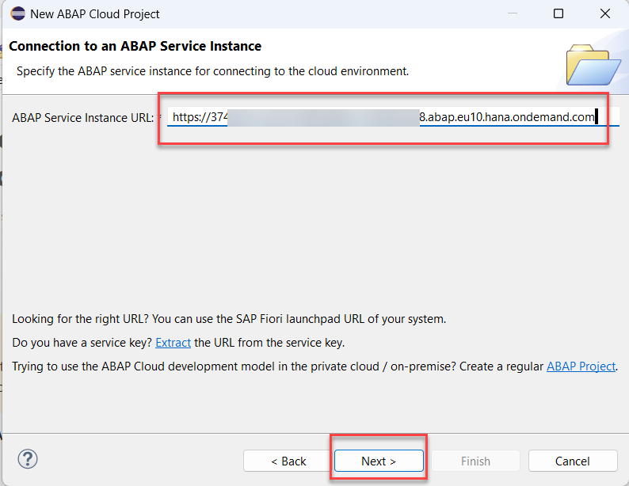 

8. Click **Open Logon Page in Browser**.

   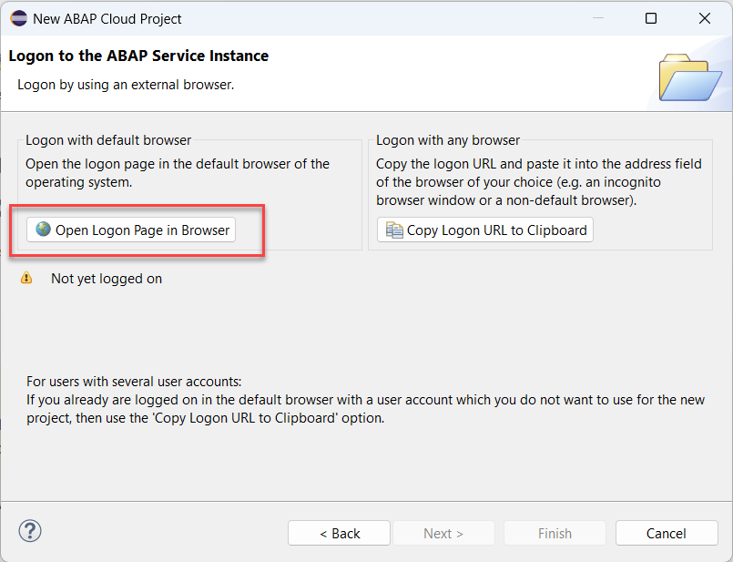 

9. Now you've been authenticated automatically. Provide your credentials if requested. The credentials are the same you used to logon to the SAP Build Lobby. 

   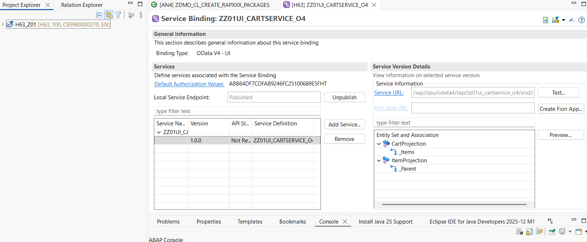 

10. You can rename the project such that it includes your group id e.g.**H63_###**. 

    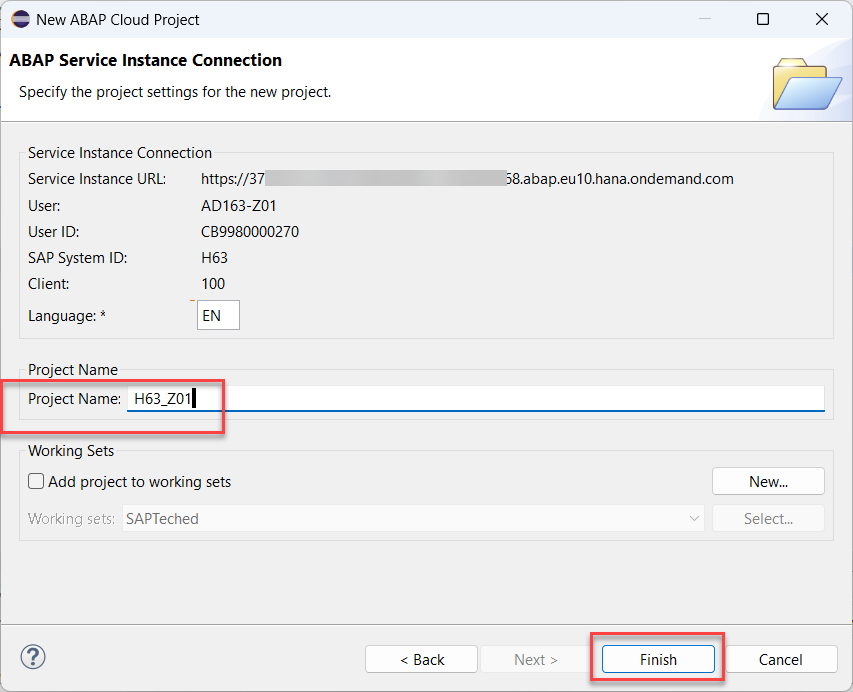 
 
11. When being asked, open the associated (ABAP) perspective by clicking **Open Perspective** and check the check box **Remember my decsion**. 

    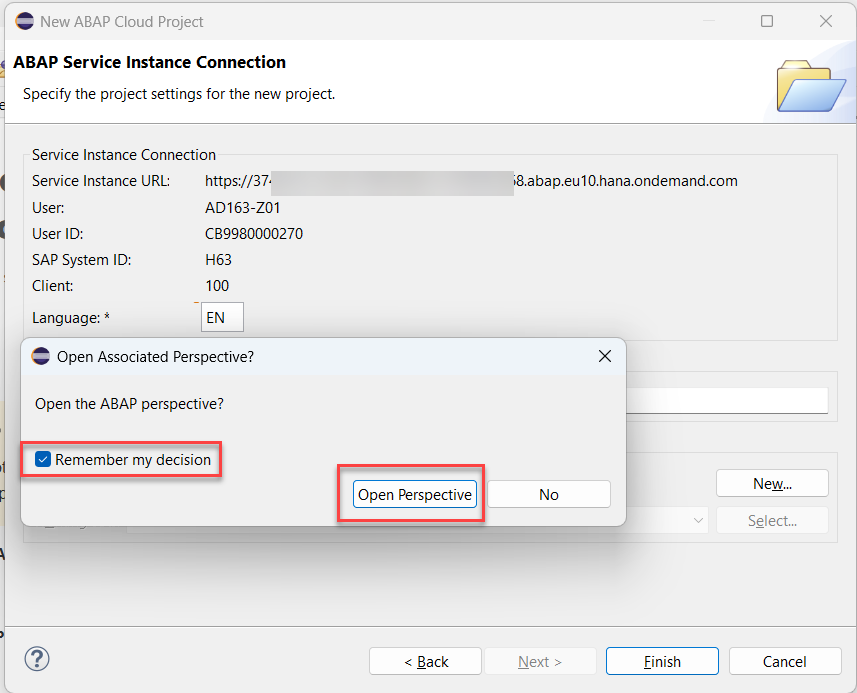

12. This will finally open the Service Binding in ADT  

    

</details>


### 3.1.2 - Create an ABAP Cloud Project from within ADT

-->

<details>
<summary>Click to expand</summary>

1. Open Eclipse. Make sure you have installed ADT in your Eclipse.   

       

2. Select **File** > **New** > **Other** > **ABAP Cloud Project** and click **Next >**.

   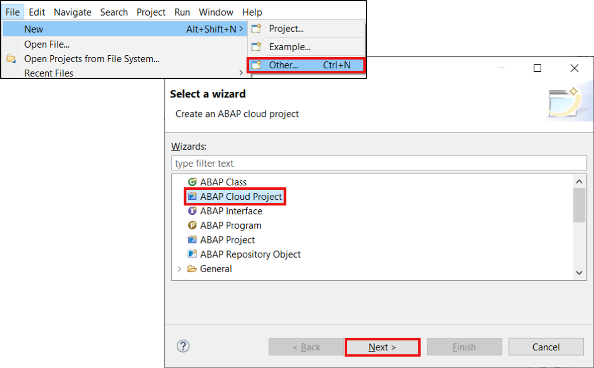

3. Copy the URL of the SAP BTP ABAP Environment System into the field **ABAP Service Instance URL** and click **Next >**.

   > The URL of the SAP BTP ABAP Environment will be provided to you by the course instructors.
   > The URL is provided as a shortened URL in a format such as `https://url.sap/abc123`    
   > ⚠️Copy the shortened URL into your browser and copy **the expanded URL** from the browser into the field **ABAP Service Instance URL**.    

   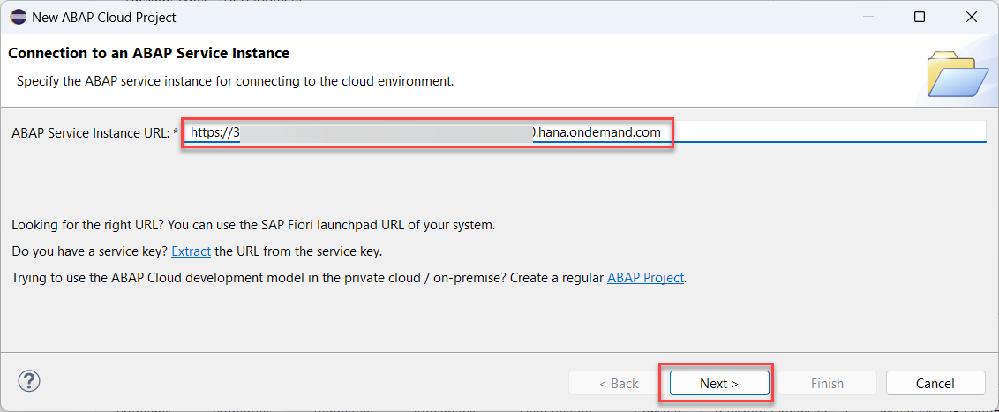

4. Click **Open Logon Page in Browser**.

   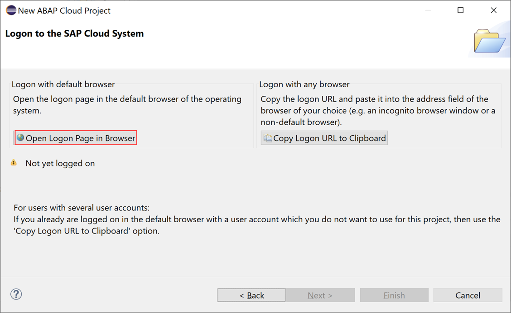

5. Now you've been authenticated automatically. Provide your credentials if requested. The credentials are the same you used to logon to the SAP Build Lobby.   

   You can rename the project e.g. such that it includes your group id to `H63_EN_###`

   Go back to ADT.

   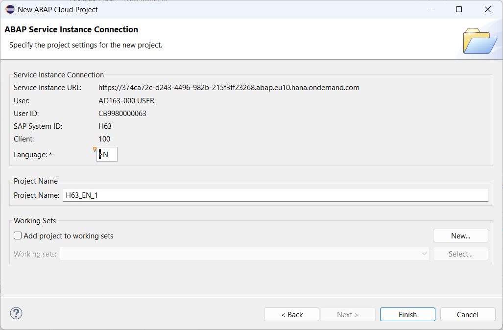

   Click **Finish**.


6. The SAP BTP ABAP Environment system `H63` appears on the project explorer.

7. Right click on the folder **Favorite Packages** and choose **Add Package** from the context menue.
  
   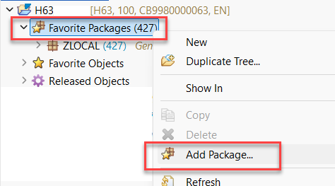 

8. Enter the name `ZAD163_###` of your package and press **OK**.      

</details>

## 3.2 - Test the generated RAP business object

Within the package `ZAD163_###` you will find the generated service binding `Z###UI_CARTSERVICE_O4`. Using the SAP Fiori Elements preview functionality a test UI is being provided without having to deploy the Fiori Elements App.

<details>
<summary>Click to expand</summary>

1. Open the generated service binding `Z###UI_CARTSERVICE_O4` using ADT.  

2. Double click on the leading entity `CartProjection` or select it and click on the **Preview** button.
  
   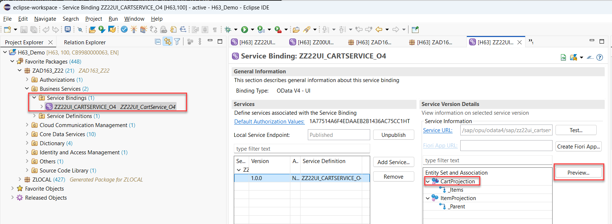

3. Use the **Create** button to create a new Cart entity.

You will notice that basic operations such as **create**, **update** and **delete** (CRUDQ) work fine. However there is no business logic that has been added yet.

</details>

## 3.3 - Define determinations 

In the previous exercise, you have enhanced the base business object data model as well as the projected business object data model and its metadata extension.

In the present exercise, you will define and implement the determination `calculateOrderID` in the behavior definition for the `Cart` entity.   

The determination `calculateOrderID` will be used to automatically calculate and set a sematic key for the field `orderID`.

You will use the Entity Manipulation Language (EML) to implement the transactional behavior of the _Cart_ business object. 

<details>
<summary>Click to expand</summary>

In the following you will define the determination  **`calculateOrderID`** in the behavior definition of the _Cart_ entity.

The determination `calculateOrderID` will be used to calculate the sematic key field `OrderId` when the data is saved.

1. Go to the behavior definiton of the _Cart_ business object entity  `ZZ24R_Cart` using ADT and insert the following statements after the statement **`delete;`** as shown on the screenshot below: 

   ```ABAP 
        determination calculateOrderID on save { create; }  

        field ( readonly )
        OrderID; 
   ```     

   > **Short explanation**:  
   > The statement specifies the name of the new determination **`calculateOrderID`**.   
   > The determination **`calculateOrderID`** is configured for `on save` and is thus run when the data is initially saved. (When the **Create** button is pressed.)   
   > Since the field `OrderID` is now being calculated automatically by the aforementioned determination we will make the field `OrderID` readonly as well.   

   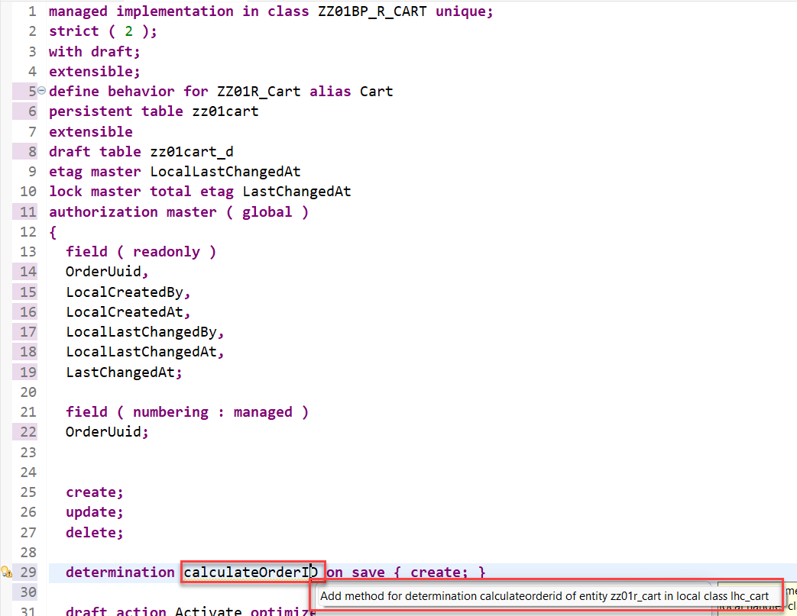  

2. Save  and activate  the changes.

3. Now, declare the required method in behavior implementation class with a ADT Quick Fix.
  
   Set the cursor on the determination name **`calculateOrderID`** and press **Ctrl+1** to open the **Quick Assist** view and select the entry _`Add  missing method of entity zr_AD163U### in local handler class lhc_cart ...`_ in the popup as shown in the screen shot above.   

   As result a `FOR DETERMINE` method called **`calculateOrderID`**  will be added to the local handler class **`lhc_cart`** of the behavior pool of the _Cart_ business object entity  **`Z###BP_R_CART`**.
    

4. Save  and activate  the changes in the local handler class **`lhc_cart`**.  

You are now done already with the definition of your determination.

</details>

## 3.4 - Implement the determination using Joule 💎

You will now implement the logic of the defined determination in the behavior pool. 

<details>
<summary>Click to expand</summary>

1. First check the interface of the method **`calculateOrderID`** in the declaration part of the local handler class `lhc_cart`. 

   For that, set the cursor on the method name, **`calculateOrderID`**, press **F2** to open the **ABAP Element Info** view, and examine the full method interface. 
   
   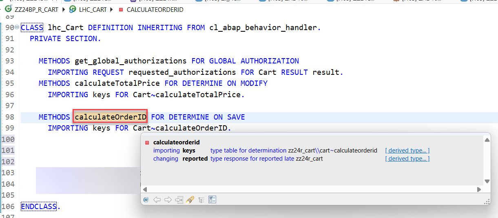  

   **Short explanation**:  
   - The addition **`FOR DETERMINE`** indicates that the method provides the implementation of a determination and the addition **`ON SAVE`** indicates the specified trigger time.
   - `IMPORTING`parameter **`keys`** - is an internal table containing the keys of the instances for which the determination will be executed   
   - Implicit **`CHANGING`** parameter **`reported`** - used to return messages in case of failure   


1. Now implement the method **`calculateOrderID`** in the implementation part of the local handler class. Place the cursor behind the statement `METHOD calculateOrderID.` and press **Ctrl+1** to start the quick assistant **Predict RAP business logic**.

   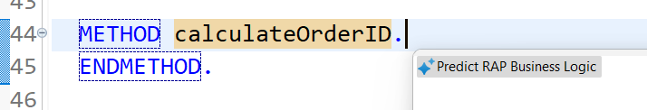 

2. Select the **Predict RAP business logic** entry and enter the following prompt `Calculate a semantic key using the number of entries in table Z###CART` in the dialogue box of the instant action and press **Run**.
   
   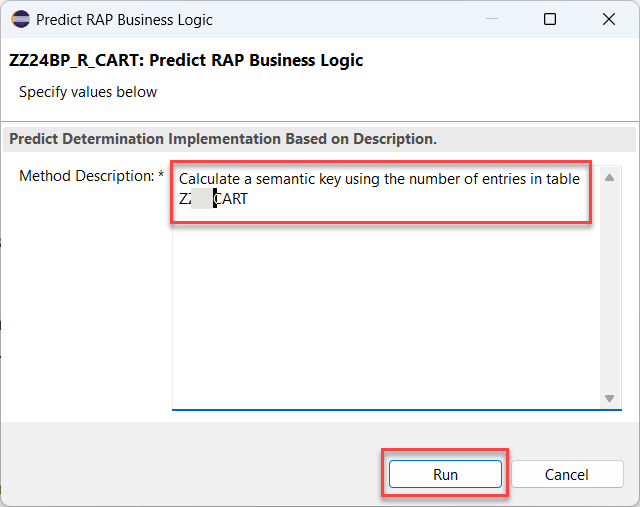 

3. Either choose (and correct if needed) the suggested code or take the following code snippet below for your convenience:   

   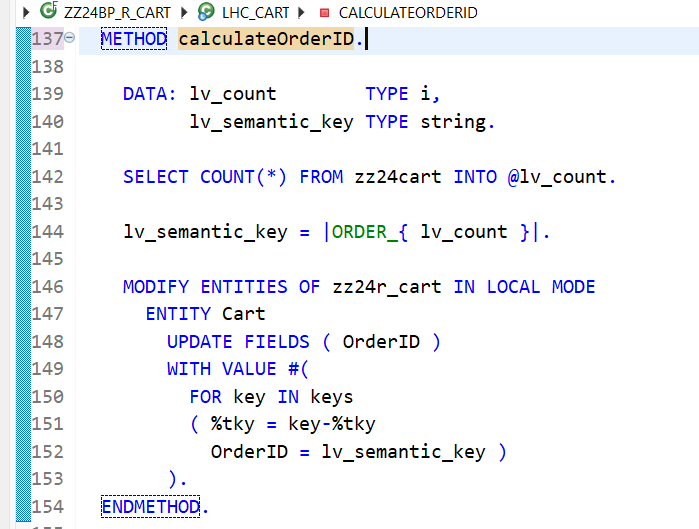 

```ABAP    

  METHOD calculateOrderID.
  
  DATA: lv_count        TYPE i,
          lv_semantic_key TYPE string.

    " Count the number of entries in the table 
    SELECT COUNT(*) FROM Z###Cart INTO @lv_count.

    " Calculate the semantic key based on the count
    lv_semantic_key = |{ lv_count + 1 }|.

    " Read the entities to be updated
    READ ENTITIES OF Z###R_Cart IN LOCAL MODE
      ENTITY Z###R_Cart "Cart
        FIELDS ( OrderID )
        WITH CORRESPONDING #( keys )
      RESULT DATA(entities).

    " Update the OrderID with the calculated semantic key
    LOOP AT entities INTO DATA(entity).
      MODIFY ENTITIES OF Z###R_Cart IN LOCAL MODE
        ENTITY Z###R_Cart "Cart
          UPDATE FIELDS ( OrderID )
          WITH VALUE #(
            ( %tky = entity-%tky
              OrderID = lv_semantic_key )
          ).      
    ENDLOOP.
  
  
  ENDMETHOD.

```
</details>  

## 3.5 - Define validations

In the previous exercise, you have defined and implemented a determination that is run during the creation of new instances of the BO entity _Cart_. 

Since the content can be invalid (e.g. the date that has been selected as a delivery date lies in the past) we would like to check the data quality upfront.   

<details>
<summary>Click to expand</summary>

In the present exercise, you're going to define and implement a validation for the field `RequestDeliveryDate` in the entity `Cart` to check the following:

|Entity | Validation    | Purpose |
| -------- | -------- | ------- |
| Cart | `validateRequestDeliveryDate` | The value for the field `RequestDeliveryDate` shall not be initial and shall not lie in the past.     |

This validation (as all validations) is only performed in the back-end (not on the UI) and is triggered independently of the caller, i.e. Fiori UIs or EML APIs.


<!--
> ℹ **Frontend validation & Backend validations**
> Validations are used to ensure the data consistency.
> As the name suggests, **frontend validations** are performed on the UI. They are used to improve the user experience by providing faster feedback and avoiding unnecessary roundtrips. In the RAP context, front-end validations are defined using CDS annotation or UI logic.  
> On the other hand, **backend validations** are performed on the back-end. They are defined in the BO behavior definitons and implemented in the respective behavior pools.
> Frontend validations can be easily bypassed - e.g. by using EML APIs in the RAP context. Therefore, **backend validations are a MUST** to ensure the data consistency.

### About Validations

A validation is an optional part of the business object behavior that checks the consistency of business object instances based on trigger conditions.

A validation is implicitly invoked by the business object’s framework if the trigger condition of the validation is fulfilled. Trigger conditions can be `MODIFY` operations and modified fields. The trigger condition is evaluated at the trigger time, a predefined point during the BO runtime. An invoked validation can reject inconsistent instance data from being saved by passing the keys of failed instances to the corresponding table in the `FAILED` structure. Additionally, a validation can return messages to the consumer by passing them to the corresponding table in the `REPORTED` structure.

> **Further reading**: [Validations](https://help.sap.com/viewer/923180ddb98240829d935862025004d6/Cloud/en-US/171e26c36cca42699976887b4c8a83bf.html)

-->

  
1. Open your behavior definition **`Z###R_Cart`** using ADT.    

2. Because empty values will not be accepted for the field **`RequestDeliveryDate`**, specify it as a _mandatory_ field by adding the following code snippet at the top of the behavior definition of the `Cart` entity as shown on the screenshot below.

```ABAP  
  // mark mandatory fields
  field ( mandatory )
  RequestDeliveryDate;
```    

   Your source code should look like this:   

   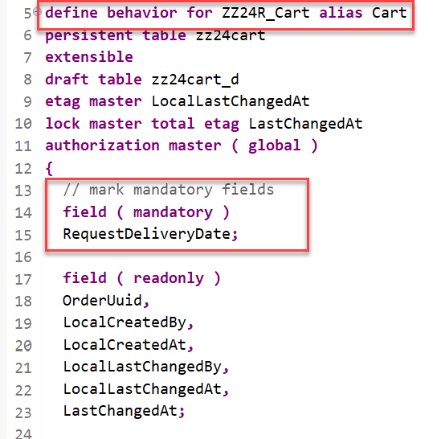     

3. Define the validation **`validateRequestDeliveryDate`**. For that, add the following code snippet in the behavior definition of the `Cart` entity right before the draft actions as shown on the screenshot below.

```ABAP      
      validation validateRequestDeliveryDate on save { create; field RequestDeliveryDate; }
```   
 
4. In order to have draft instances being checked by validations before they become active, they have to be specified for the **`draft determine action prepare`** in the behavior definition.
  
   Replace the code line **`draft determine action Prepare;`** with the following code snippet as shown on the screenshot below

```ABAP
    //draft determine action Prepare;
    draft determine action Prepare
    {     
     validation validateRequestDeliveryDate;
    }
```

   Your source code should look like this: 

   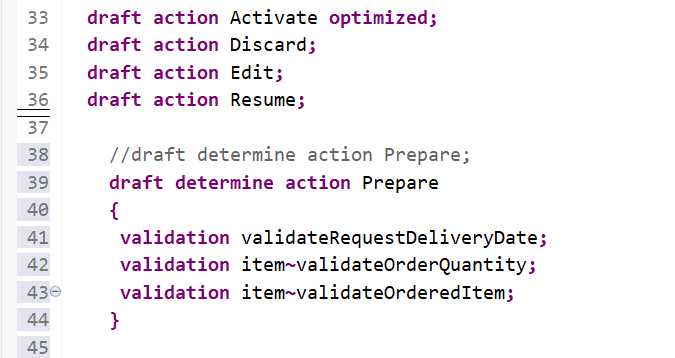  

   **Short explanation**:
   - Validations are always invoked during the save and specified with the keyword `on save`.
 
   - `validateRequestDeliveryDate` is a validation with trigger operation `create` and trigger field `RequestDeliveryDate`   
    

   **ℹ Hint**:
   > In case a validation should be invoked at every change of the BO entity instance, then the trigger conditions `create`and `update`
   > must be specified: e.g. `validation validateRequestDeliveryDate on save { create; update; }`

5. Save  and activate  the changes.

6. Add the appropriate **`FOR VALIDATE ON SAVE`** methods to the local handler classes of the behavior pool of the _Cart_ BO entity via quick fix.  

   For that, set the cursor on one of the validation name `validateRequestDeliveryDate`and press **Ctrl+1** to open the **Quick Assist** view and select the entry **`Add method for validation validaterequestdeliverydate of entity z###r_cart...`**

   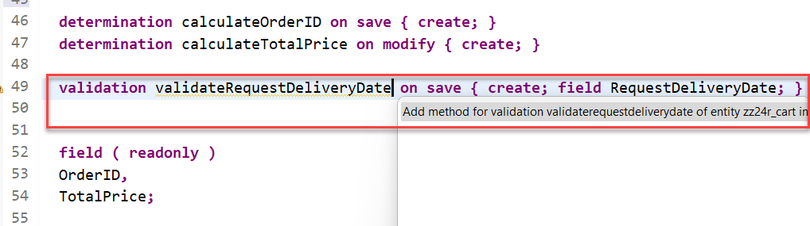  
   
   As a result, the **`FOR VALIDATE ON SAVE`** method **`validateRequestDeliveryDate`** will be added to the local handler classes `lhc_cart` of the behavior pool `z###bp_r_cart` of the _Cart_ BO entity.

7. Save  and activate  the changes.

> Hint:  
> If you get an error message in the behavior implementation `The entity "ZR_CART###" does not have a validation "VALIDATEREQUESTDELIVERYDATE".` try to activate the behavior definition once again.  

</details>

## 3.6 - Implement the validations using Joule 💎   

In this exercise we will implement the previously created validation.

<details>
<summary>Click to expand</summary>
 

1. First, check the interface of the new method in the declaration part of the local handler class `lhc_cart` of the behavior pool of the _Cart_ BO entity **`z###bp_r_cart`**.

   For that, set the cursor on the method name, e.g. **`validateRequestDeliveryDate`**, press **F2** to open the **ABAP Element Info** view, and examine the full method interface.

   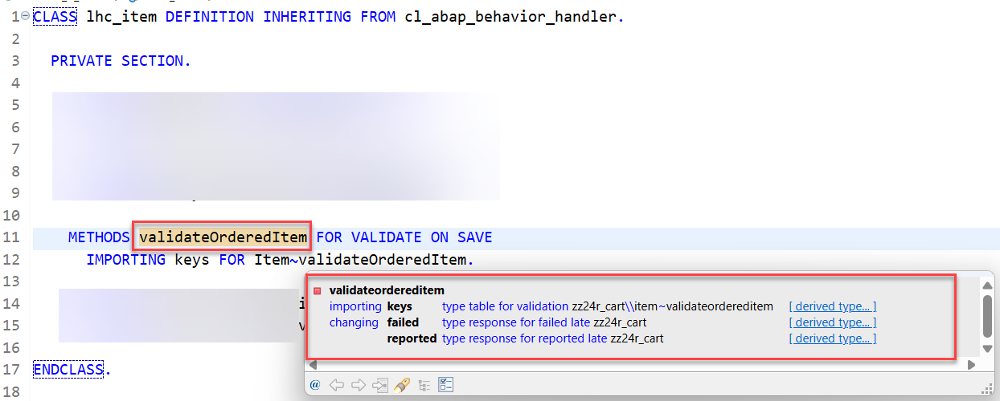 

   **Short explanation**:  
   - The addition **`FOR VALIDATE ON SAVE`** indicates that the method provides the implementation of a validation executed on save. Validations are always executed on save.
   - Method signature for the validation method:
     - `IMPORTING`parameter **`keys`** - an internal table containing the keys of the instances on which the validation should be performed.
     - Implicit `CHANGING` parameters (aka _implicit response parameters_):  
       - **`failed`**   - table with information for identifying the data set where an error occurred
       - **`reported`** - table with data for instance-specific messages

   You can go ahead and implement the validation method.

2. Now implement the newly created method in the implementation part of the class.
  
    The logic consists of the following main steps:
    1. Read the ShoppingCart instance(s) of the transferred keys (**`keys`**) using the EML statement **`READ ENTITIES`**.
    2. The addition **`FIELDS`** is used to specify the fields to be read. E.g. only **`RequestDeliveryDate`** is relevant for the  validation `validateRequestDeliveryDate`.  
       The addition `ALL FIELDS` can be used to read all fields.
    3. The addition **`IN LOCAL MODE`** is used to exclude feature controls and authorization checks.
    4. Check if the value of the field `RequestDeliveryDate` is either initial or lies in the past.  
    5. Prepare/raise messages for all transferred _Cart_ instances with initial and or non valid value of `RequestDeliveryDate` and set the changing parameter **`reported`**


3. Now implement the method **`validateRequestDeliveryDate`** in the implementation part of the local handler class. Place the cursor behind the statement `METHOD validateRequestDeliveryDate.` and press **Ctrl+1** to start the quick assistant.

4. In the popup select **Predict RAP business logic**.  

   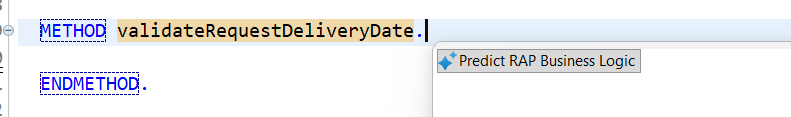

5. Enter the following prompt:  
   **`Check that the field is not initial and that the date entered in the field is in the future. Do not use the outdated sy-datum statement.`**   
   in the dialogue box of the instant action and press **Run**.    

6. Check that the generated code looks like the following. 

   > ℹ️ Hint:
   > It is important that the code contains an `APPEND` statement that clears the state area within the `loop`statement, such as 
     ```ABAP
         APPEND  VALUE #(
          %tky        = entity-%tky
          %state_area = 'Validation-RequestDeliveryDate'
         ) TO reported-Item.
     ```  
   > And the state area should have a unique value, so change (if necessary) the value `validation` to something like `Validation-RequestDeliveryDate`.    

   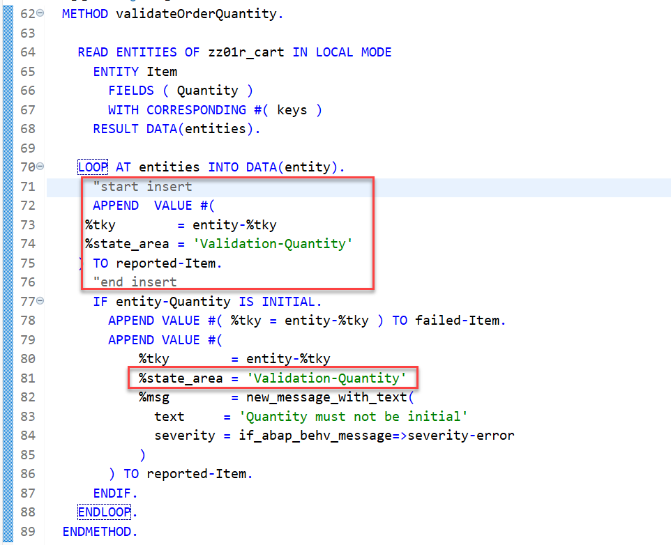

   A working implementation looks like follows:  

 ```ABAP
   METHOD validateRequestDeliveryDate.

    READ ENTITIES OF z###r_cart IN LOCAL MODE
      ENTITY z###r_cart "Cart
        FIELDS ( RequestDeliveryDate )
        WITH CORRESPONDING #( keys )
      RESULT DATA(entities).

    DATA(current_date) = cl_abap_context_info=>get_system_date( ).

    LOOP AT entities INTO DATA(entity).
      APPEND VALUE #(  %tky               = entity-%tky
                       %state_area        = 'Validation-RequestDeliveryDate'
                     ) TO reported-cart.
      IF entity-RequestDeliveryDate IS INITIAL OR entity-RequestDeliveryDate <= current_date.
        APPEND VALUE #( %tky = entity-%tky ) TO failed-Cart.
        APPEND VALUE #(
            %tky        = entity-%tky
            %state_area = 'Validation-RequestDeliveryDate'
            %msg        = new_message_with_text(
              text     = 'RequestDeliveryDate must be in the future and not initial.'
              severity = if_abap_behv_message=>severity-error
            )
        ) TO reported-Cart.
      ENDIF.
    ENDLOOP.
  ENDMETHOD.

 ```

</details>

## 3.7 - Preview and Test the enhanced Online Shop App

> Now the SAP Fiori elements app can be tested.    

You can either refresh your application in the browser using **F5** if the browser is still open - or go to your service binding **`ZUI_AD163U###_O4`** and start the Fiori elements App preview for the **`CartProjection`** entity set.

<details>
<summary>Click to expand</summary>

1. Click **Create** to create a new entry.

2. Select a requested delivery date **that lies in the past**. 

   The draft will be updated.

3. Now click **Create**. You should get following error messages displayed:  
   **Requested delivery date is in the past** .

    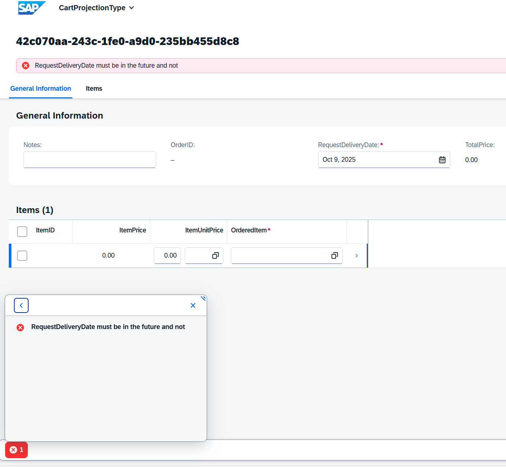

</details>

## Summary 

Now that you have... 

- defined a determination and a validations in the behavior definition, 
- implemented them in the behavior pool, and
- previewed and tested the enhanced Fiori elements app,

you can continue with the next exercise.


## Summary & Next Exercise

**[Exercise 4: Create, preview and adapt a SAP Fiori elements application](../ex4/README.md)**.


[^Top of page](#)
